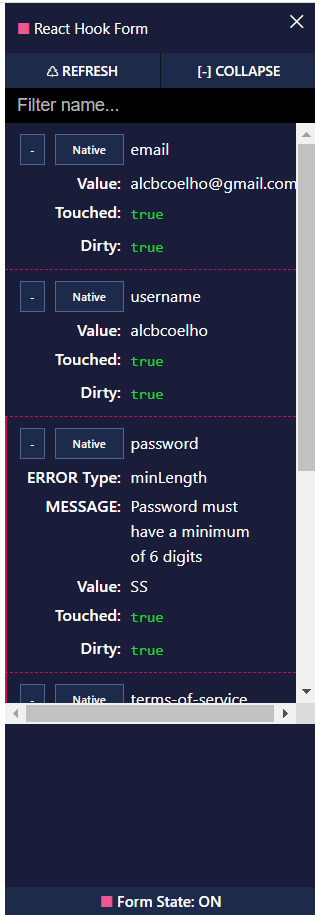

# React Hook Form

```
npm install react-hook-form
```

## React Hook Form DevTools

```
npm install -D @hookform/devtools
```

Allows us to see details whilst messing around with forms through a handy component (see RegistrationForm.jsx for details on how to implement it)



# Validation rules
React Hook form supports various HTML validation rules:

- required
- minLength & maxLength
- min & max